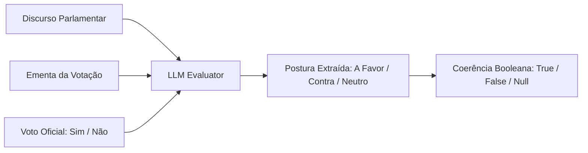
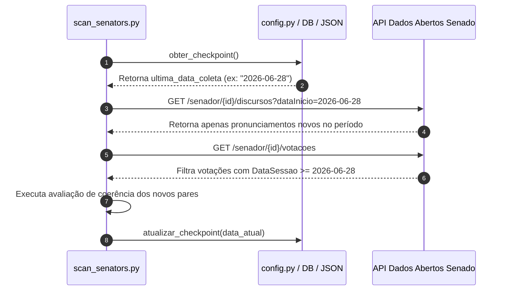

# Coerência Política Real e Carga Incremental

Este documento detalha as duas evoluções arquiteturais fundamentais implementadas no backend do **Dito e Feito**: a **Mudança de Paradigma para Coerência Política Real** e a **Carga Histórica Inicial com Atualização Incremental (Checkpoints)**.

---

## 🎯 1. Mudança de Paradigma: Coerência Política Real

### O Problema Conhecido (Afinidade Temática)
Nas versões iniciais do sistema, a inteligência artificial (LLM/embeddings) avaliava apenas a **Afinidade Temática** entre o discurso de um parlamentar e a ementa da votação (medindo de 0.0 a 1.0 se tratavam do mesmo assunto). 

Isso gerava uma falha conceitual grave: se um parlamentar discursasse veementemente **contra** um projeto de lei, mas na hora da votação registrasse voto **"Sim" (a favor)**, o modelo antigo atribuía uma pontuação alta de afinidade (pois o assunto era o mesmo), mascarando uma **Incoerência Política explícita**.

### A Solução (Avaliação Booleana de Coerência)
O pipeline de IA foi reformulado para receber o **trinômio fundamental**: `(Discurso, Ementa da Votação, Voto Oficial Registrado)`.



### Regras de Avaliação do Prompt
A LLM (rodando via **Ollama `qwen2.5-coder:7b`**, **Groq** ou **OpenRouter**) segue regras determinísticas rigorosas:

1. **Extração de Postura**: Analisa o discurso e classifica a posição do parlamentar em relação à ementa como `'A Favor'`, `'Contra'` ou `'Neutro'`.
2. **Matriz de Coerência**:
   * **Postura 'A Favor' + Voto 'Sim'** $\rightarrow$ `coerente: true`
   * **Postura 'Contra' + Voto 'Não'** $\rightarrow$ `coerente: true`
   * **Postura 'A Favor' + Voto 'Não'** $\rightarrow$ `coerente: false`
   * **Postura 'Contra' + Voto 'Sim'** $\rightarrow$ `coerente: false`
   * **Postura 'Neutro' ou Voto 'Abstenção' / 'Ausente' / 'Obstrução'** $\rightarrow$ `coerente: null` (excluído do denominador)

### Cálculo da Porcentagem Global
A porcentagem geral exibida nos gráficos do dashboard (`score_coerencia`) reflete a **taxa real de integridade**:

$$\text{Score Global (\%)} = \left( \frac{\text{Qtd. de Votos Coerentes (true)}}{\text{Total de Votos Avaliados (true + false)}} \right) \times 100$$

---

## ⏱️ 2. Carga Histórica Inicial e Atualização Incremental (Checkpoints)

Para otimizar o consumo de APIs do governo, limites de requisições HTTP e custos/tempo de inferência da LLM, o sistema implementou um controle de **Checkpoints por Data**.

### Arquitetura de Checkpoint Híbrida
O controle de estado da `ultima_data_coleta` é gerenciado pelo módulo `backend/utils/config.py`:
1. **Banco de Dados (Produção)**: Registrado na tabela `parametro_coleta` do PostgreSQL (Supabase).
2. **Fallback Local**: Se o banco estiver indisponível ou rodando sem banco (`--no-db`), o estado é gravado e mantido no arquivo `backend/config_data.json`.

### Fluxo de Execução Incremental (Delta)


### Prevenção de Duplicidades
Para evitar reavaliar ou duplicar registros no banco de dados em execuções com sobreposição de períodos, a função `salvar_no_banco` verifica a existência da tupla antes da inserção:
```sql
SELECT 1 FROM score_coerencia 
WHERE parlamentar_id = $1 AND justificativa = $2 AND score = $3
LIMIT 1;
```

---

## 🚀 Como Executar o Pipeline Localmente com Ollama

Caso deseje executar a varredura completa utilizando o modelo local `qwen2.5-coder:7b`:

```bash
# Certifique-se de que o Ollama está rodando localmente
ollama run qwen2.5-coder:7b

# Em outro terminal, execute o orquestrador do backend
python backend/scan_senators.py
```
