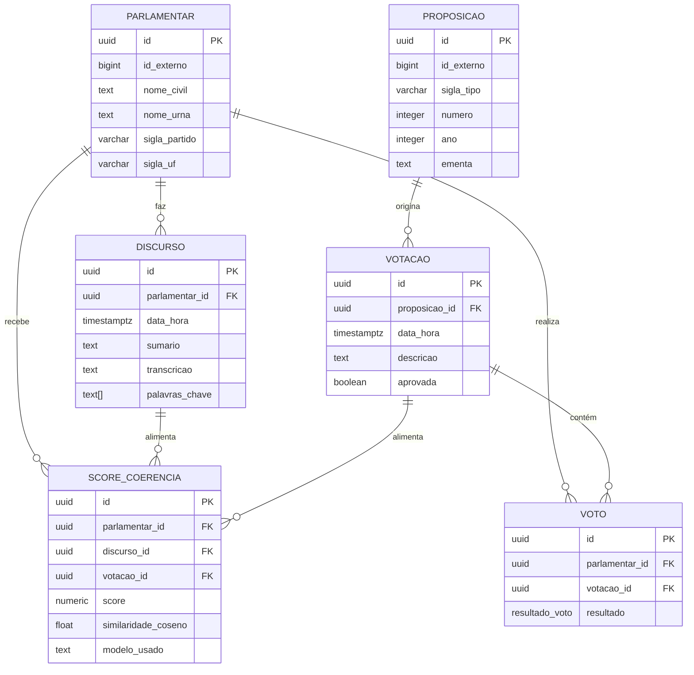

# 03 — Modelagem de Entidades — Dito e Feito

Esboço do modelo relacional do sistema, com as principais entidades, seus atributos e relacionamentos.

---

## Entidades principais

### 1. `parlamentar`
Representa um deputado federal com seus dados cadastrais.

```sql
CREATE TABLE parlamentar (
    id              UUID PRIMARY KEY DEFAULT gen_random_uuid(),
    id_externo      BIGINT UNIQUE,           -- ID da API da Câmara
    nome_civil      TEXT NOT NULL,
    nome_urna       TEXT,
    sigla_partido   VARCHAR(15),
    sigla_uf        VARCHAR(2),
    foto_url        TEXT,
    email           TEXT,
    situacao        TEXT,                    -- ex: "Exercício", "Afastado"
    dados_api       JSONB,                   -- resposta bruta da API (opcional)
    criado_em       TIMESTAMPTZ DEFAULT now(),
    atualizado_em   TIMESTAMPTZ DEFAULT now()
);
```

---

### 2. `discurso`
Pronunciamentos feitos pelo parlamentar em plenário ou comissões.

```sql
CREATE TYPE fase_discurso AS ENUM (
    'Plenário', 'Comissão', 'CPI', 'Outro'
);

CREATE TABLE discurso (
    id              UUID PRIMARY KEY DEFAULT gen_random_uuid(),
    id_externo      BIGINT UNIQUE,
    parlamentar_id  UUID NOT NULL REFERENCES parlamentar(id) ON DELETE CASCADE,
    data_hora       TIMESTAMPTZ NOT NULL,
    fase            fase_discurso,
    sumario         TEXT,
    transcricao     TEXT,                    -- texto completo, se disponível
    palavras_chave  TEXT[],                  -- extraídas por NLP
    dados_api       JSONB,
    criado_em       TIMESTAMPTZ DEFAULT now()
);
```

---

### 3. `proposicao`
Uma proposta legislativa (PL, PEC, MPV, etc.) que vai a votação.

```sql
CREATE TABLE proposicao (
    id              UUID PRIMARY KEY DEFAULT gen_random_uuid(),
    id_externo      BIGINT UNIQUE,
    sigla_tipo      VARCHAR(10),             -- ex: "PL", "PEC", "MPV"
    numero          INTEGER,
    ano             INTEGER,
    ementa          TEXT,
    keywords        TEXT[],
    dados_api       JSONB,
    criado_em       TIMESTAMPTZ DEFAULT now()
);
```

---

### 4. `votacao`
Evento de votação em plenário sobre uma proposição.

```sql
CREATE TABLE votacao (
    id              UUID PRIMARY KEY DEFAULT gen_random_uuid(),
    id_externo      TEXT UNIQUE,             -- ID da API (pode ser string)
    proposicao_id   UUID REFERENCES proposicao(id) ON DELETE SET NULL,
    data_hora       TIMESTAMPTZ NOT NULL,
    descricao       TEXT,
    aprovada        BOOLEAN,
    dados_api       JSONB,
    criado_em       TIMESTAMPTZ DEFAULT now()
);
```

---

### 5. `voto`
O voto individual de um parlamentar em uma votação específica.

```sql
CREATE TYPE resultado_voto AS ENUM (
    'Sim', 'Não', 'Abstenção', 'Obstrução', 'Art. 17', 'Ausente'
);

CREATE TABLE voto (
    id              UUID PRIMARY KEY DEFAULT gen_random_uuid(),
    parlamentar_id  UUID NOT NULL REFERENCES parlamentar(id) ON DELETE CASCADE,
    votacao_id      UUID NOT NULL REFERENCES votacao(id) ON DELETE CASCADE,
    resultado       resultado_voto NOT NULL,
    criado_em       TIMESTAMPTZ DEFAULT now(),
    UNIQUE (parlamentar_id, votacao_id)     -- um parlamentar vota uma vez por votação
);
```

---

### 6. `score_coerencia`
Score calculado pela IA comparando os discursos e votos de um parlamentar.

```sql
CREATE TABLE score_coerencia (
    id                  UUID PRIMARY KEY DEFAULT gen_random_uuid(),
    parlamentar_id      UUID NOT NULL REFERENCES parlamentar(id) ON DELETE CASCADE,
    discurso_id         UUID REFERENCES discurso(id) ON DELETE SET NULL,
    votacao_id          UUID REFERENCES votacao(id) ON DELETE SET NULL,
    score               NUMERIC(5, 2) CHECK (score >= 0 AND score <= 100),
    similaridade_coseno FLOAT,              -- métrica do modelo NLP
    modelo_usado        TEXT,               -- ex: "sentence-transformers/..."
    justificativa       TEXT,               -- explicação gerada pela IA
    calculado_em        TIMESTAMPTZ DEFAULT now()
);
```

---

## Diagrama de relacionamentos (texto)

```
parlamentar
    │
    ├──< discurso         (1 parlamentar → N discursos)
    │
    ├──< voto             (1 parlamentar → N votos)
    │        │
    │        └──> votacao (N votos → 1 votação)
    │                │
    │                └──> proposicao (N votações → 1 proposição)
    │
    └──< score_coerencia  (1 parlamentar → N scores)
             ├──> discurso
             └──> votacao
```

---

## Diagrama ER (Mermaid)

> Cole este código em [mermaid.live](https://mermaid.live) para visualizar o diagrama.



---

## Decisões de modelagem

| Decisão | Justificativa |
|---|---|
| UUID como PK | Evita exposição de sequência, facilita integração entre serviços |
| `id_externo` separado | Preserva o ID da API sem depender dele como PK |
| `dados_api JSONB` | Permite armazenar a resposta bruta para reprocessamento futuro |
| ENUM para `resultado_voto` | Garante integridade sem depender da aplicação |
| `UNIQUE (parlamentar_id, votacao_id)` em `voto` | Impede duplicidade de votos |
| `score_coerencia` como tabela separada | O cálculo pode ser refeito com modelos diferentes |
