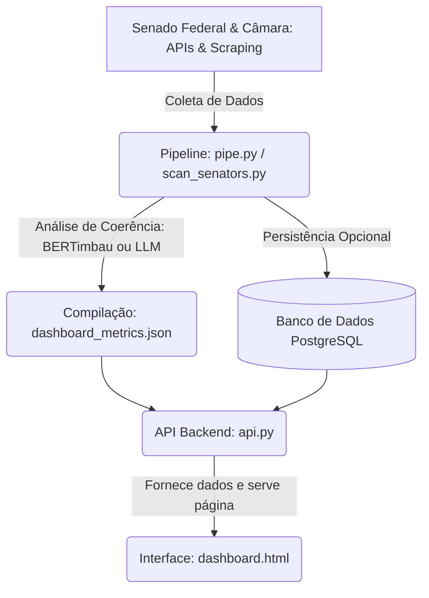

# Fluxo de Dados: Do Pipeline ao Dashboard

Este documento descreve como funciona o fluxo de ponta a ponta do sistema **Dito e Feito**, detalhando a coleta de dados de parlamentares, a análise de coerência por IA, a geração do arquivo de métricas, o serviço de API Flask e a renderização final no dashboard interativo.

---

## 🏛 Arquitetura Geral

O fluxo do sistema pode ser dividido em 5 etapas principais:



---

## 🔍 Componentes do Sistema

### 1. Fontes de Dados (APIs do Governo)
*   **Dados Abertos do Senado (XML/JSON)**: Utilizado para listar senadores em exercício, obter histórico de votações nominais públicas e coletar discursos (pronunciamentos).
*   **Dados Abertos da Câmara (JSON)**: Utilizado para listagem e dados de deputados.
*   **Web Scraping do Senado**: Extração do conteúdo na íntegra dos pronunciamentos parlamentares a partir das páginas HTML de registros taquigráficos.

### 2. Processadores e Analisadores (Pipelines)
O sistema conta com dois scripts principais para processamento local ou varredura de dados:

*   **`backend/pipe.py`**:
    *   Focado em teste e validação rápida.
    *   Carrega localmente o modelo de processamento de linguagem natural **BERTimbau** (`neuralmind/bert-base-portuguese-cased`).
    *   Faz o scraping de pronunciamentos de uma lista fixa de 10 senadores e obtém suas votações nominais.
    *   Gera vetores de *embeddings* semânticos para o discurso e para a ementa de cada votação.
    *   Calcula a **similaridade de cosseno** (escala centesimal) entre eles, classificando em faixas de threshold: *Coerente*, *Parcialmente Alinhado*, *Divergente* ou *Não Relacionado*.
    *   Salva o arquivo compilado diretamente em `backend/dashboard_metrics.json`.

*   **`backend/scan_senators.py`**:
    *   Orquestrador de produção em lote (batch execution).
    *   Gerencia a **Carga Histórica e Atualização Incremental** via checkpoints (`backend/utils/config.py`).
    *   Faz uma varredura filtrando senadores por partido de forma dinâmica.
    *   Implementa técnicas de otimização (*Fail Fast*):
        *   **Camada 1 (Volume)**: Verifica se o senador tem discursos no período delta da API (sem fazer scraping).
        *   **Camada 2 (Jaccard)**: Filtra os pares ementa-discurso mais próximos usando a métrica rápida de Jaccard antes de acionar a inteligência artificial complexa.
    *   **Avaliação de Coerência Política Real**: Envia o trinômio (Discurso, Ementa, Voto Oficial) para avaliação semântica contextual utilizando LLM (**Ollama local `qwen2.5-coder:7b`**, **OpenRouter** ou **Groq**), determinando se a postura assumida no discurso justifica o voto registrado em plenário.
    *   Salva as métricas no banco de dados PostgreSQL (opcional) com prevenção de duplicidade e gera o arquivo consolidado `backend/dashboard_metrics.json`.

### 3. API do Backend (`backend/api.py`)
Servidor Flask independente executado por padrão na porta **5001**.
*   **Leitura de Dados**: Ao receber chamadas, a API tenta ler as informações consolidadas a partir do banco de dados PostgreSQL (`DATABASE_URL`). Caso o banco esteja offline ou inacessível, ela aplica automaticamente o **fallback local** lendo o arquivo `backend/dashboard_metrics.json`.
*   **Endpoints Principais**:
    *   `GET /`: Serve a interface visual `dashboard.html`.
    *   `GET /dashboard_metrics.json`: Serve o arquivo contendo os dados estáticos gerados pelos pipelines.
    *   `GET /api/dashboard-metrics`: Retorna as métricas e o ranking consolidado de coerência (do banco ou JSON).
    *   `POST /api/analisar`: Rota para análise de coerência em tempo real de um parlamentar específico (usado na aba "Ao Vivo" do dashboard).
    *   `GET /api/senadores`: Retorna a lista de senadores ativos.

### 4. Interface Frontend (`backend/dashboard.html`)
Painel interativo e responsivo construído em Vanilla HTML, CSS e JavaScript.
*   **Consumo de Dados**: Tenta consumir o endpoint da API Flask (`/api/dashboard-metrics`). Se a API estiver indisponível, faz o fallback via requisição direta ao arquivo local `./dashboard_metrics.json`.
*   **Gráficos**: Utiliza a biblioteca **Chart.js** para plotar a coerência média dos partidos (gráfico de barras) e a distribuição geral dos senadores analisados (gráfico de dispersão/scatter).
*   **Raio-X Parlamentar (Painel Lateral)**: Exibe a ficha de cada senador contendo gauge de score, distribuição de status de voto em formato donut, barras de alinhamento e o detalhamento completo em sanfona (accordion) de cada par analisado, incluindo a ementa, o voto do parlamentar, o trecho de evidência extraído do discurso e a justificativa gerada pela IA.

---

## 🔄 Fluxo de Execução Passo a Passo

### Fase 1: Geração de Dados
1. O desenvolvedor executa o pipeline de varredura:
   ```bash
   python backend/scan_senators.py --limit-per-party 2
   # ou para um teste rápido com BERTimbau local:
   python backend/pipe.py
   ```
2. O script interage com a API e o site do Senado para coletar pronunciamentos e votações.
3. A similaridade semântica entre discursos e ementas é processada (por BERT local ou LLM externa).
4. O arquivo `backend/dashboard_metrics.json` é gravado/atualizado.

### Fase 2: Disponibilização e Exibição
1. A API Flask é iniciada:
   ```bash
   python backend/api.py
   ```
2. O usuário acessa a aplicação no navegador em `http://localhost:5001/`.
3. O servidor Flask responde servindo o arquivo `backend/dashboard.html` na rota raiz (`/`).
4. A página do navegador faz uma chamada `fetch` para `http://localhost:5001/api/dashboard-metrics`.
5. O servidor `api.py` processa a chamada, extrai os dados do PostgreSQL ou carrega do `dashboard_metrics.json` local e retorna o JSON estruturado.
6. O JavaScript em `dashboard.html` processa o JSON, renderiza os gráficos comparativos, preenche a tabela de ranking e monta a listagem do Raio-X.
7. O usuário interage com a interface (pesquisa senadores, clica para abrir o painel lateral de detalhes ou realiza uma análise em tempo real "Ao Vivo").
